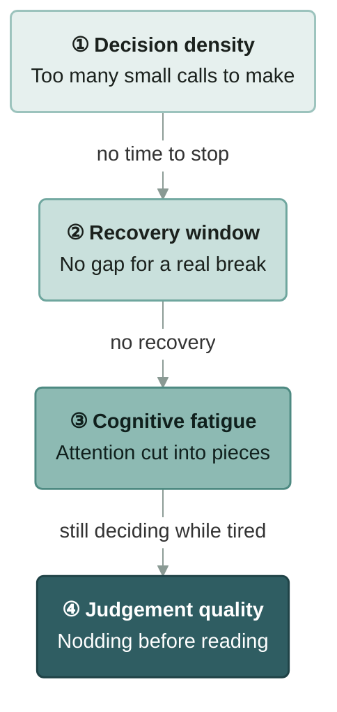

# Decision Pulse

[繁體中文](README.md) · **English**

**See whether your brain still has headroom after a day of working with AI.**

Decision Pulse is an agent skill (standard `SKILL.md` format) that you can install in Claude Code, Codex, GitHub Copilot, Gemini CLI and Cursor. It reads today's Claude Code and Codex transcripts on your own computer, builds a one-page dashboard showing where the day got heavy, and adds a few gentle suggestions backed by cognitive science.

> **Heads-up: the dashboard itself is Traditional Chinese only.** This README is in English so you can install and configure it, but the page it produces, the stage names and the suggestions are in Chinese for now.

---

## Why

AI adds a lot of small decisions to a day. The AI finishes a step and stops to ask you. You keep several conversations open and hop between them. You sit for hours. None of it is hard on its own, but it adds up, and you don't always notice when you're tired.

Decision Pulse reads your day along this chain. Each stage pushes pressure into the next:



| Stage | What it looks at | How it's measured |
|---|---|---|
| ① Decision density | How many things needed your call | Messages you sent per active hour |
| ② Recovery window | Whether you actually took a break | Longest stretch without a 10-minute break |
| ③ Cognitive fatigue | How fragmented your attention was | Conversation switches per active hour |
| ④ Judgement quality | Whether you still read carefully | Share of long AI replies you answered within seconds |

Each stage gets its **own** low / medium / high level. They are **never added into one score**: summing different things only looks precise. Kept separate, they tell you which stage to deal with first.

## What you'll see

- **One-line summary**: how many conversations, how long you actually spent in them, the busiest hour, the longest stretch without a break
- **Right now** (only when you check today): how long the current stretch has lasted and when you last took a proper break
- **Four-stage levels**: each stage's value, where it falls on low/medium/high, and what the threshold is based on
- **A few things worth noticing today**: only for stages at medium or high. Written like a colleague's reminder, not a rule engine's output
- **Details**: conversations, characters you typed, characters the AI wrote, tokens, thinking tokens, morning/afternoon/evening split, messages per hour, a timeline of work and breaks, conversation switching, prompt length, how closely you reviewed AI output
- **Activity blocks side by side**: the conditions of each work block in one table. It only lines them up; with a single day of data it can't tell you whether "later means worse"

## Install

Needs Python 3.9+. Standard library only, nothing to `pip install`. Clone this repo into your AI tool's skills folder.

| Your tool | Install location |
|---|---|
| Claude Code | `~/.claude/skills/decision-pulse` |
| Codex, GitHub Copilot, Gemini CLI, Cursor | `~/.agents/skills/decision-pulse` (the shared standard location for these tools) |

**Claude Code**

```bash
git clone https://github.com/chengwesley/decision-pulse ~/.claude/skills/decision-pulse
```

**Codex, GitHub Copilot, Gemini CLI, Cursor**

```bash
git clone https://github.com/chengwesley/decision-pulse ~/.agents/skills/decision-pulse
```

On Windows PowerShell, replace `~` with `$HOME`, e.g. `"$HOME\.agents\skills\decision-pulse"`.

Restart your AI tool once so it picks up the new skill. If you install in both locations, each copy needs its own `config.local.json`.

Official docs: [Codex](https://learn.chatgpt.com/docs/build-skills), [GitHub Copilot](https://code.visualstudio.com/docs/agent-customization/agent-skills), [Gemini CLI](https://geminicli.com/docs/cli/skills/), [Cursor](https://cursor.com/docs/skills).

## Use

Just ask in plain language (in Claude Code you can also type `/decision-pulse`), for example:

| You want to know | Try asking |
|---|---|
| Overall state | "How's my AI usage today?", "Show my decision pulse" |
| Stress and fatigue | "Am I overloaded today?", "Should I take a break?", "AI fatigue" |
| Decision quality | "How's my AI decision quality today?" |
| Focus and rhythm | "Am I switching too much today?", "How's my work rhythm today?" |
| Usage | "How much AI did I use today?", "Am I using AI too much?" |

You don't need exact words. Any question about your own AI workload, fatigue, focus or decision quality today should trigger it.

The first time, the AI asks for your role once (see below). The dashboard is an HTML file: Claude shows it as a page, other tools tell you where the file is so you can open it in a browser.

You can also run the script directly (use your own install path):

```bash
python ~/.agents/skills/decision-pulse/scripts/scan_today.py --html ~/decision-pulse.html
```

| Option | What it does |
|---|---|
| `--date 2026-09-22` | Look at a specific day (default: today) |
| `--role 工程` | Try another role's thresholds without editing your config (role names are in Chinese, see the table below) |
| `--html <path>` | Write the dashboard page |
| `--json` | Also print the full JSON |
| `--save` | Save that day's page and data into `history/` (one per date), so the same day can be reopened without rescanning |
| `--record-url <date> <url>` | Record where that day's page was published |

## Desktop clock (optional)

If you'd rather not ask every time, open `pulse-clock/pulse-clock.pyw`: a small round clock for a corner of your screen. The four arcs around it are the four stages' levels (green / yellow / orange), and the center shows the time and how long your current stretch has lasted. It refreshes every 30 minutes; click it to see the numbers and a suggestion. No notifications. See [`pulse-clock/README.md`](pulse-clock/README.md) (Chinese).

## Roles

"Normal" looks different in different jobs. An engineer may go back and forth with AI all day; a manager's job is switching between things. So some thresholds depend on your role.

Role names are stored in Chinese. Use the value in the second column for `--role` and for `"role"` in `config.local.json`.

| Role | Value | ① Density thresholds (messages / active hour) | Default high-risk topics |
|---|---|---|---|
| General | `通用` | 25 / 45 | (none) |
| Engineering | `工程` | 40 / 70 | production, 上線 (go-live), deploy, migration, 資料庫 (database), 權限 (permissions), secret |
| Operations / HR | `營運・HR` (or `HR`) | 25 / 45 | pay raise, salary, resignation, layoff, offer, grievance, contract, signing, access revocation, personal data (Chinese keywords) |
| Sales | `業務` | 20 / 40 | quote, discount, contract, signing, refund, payment terms (Chinese keywords) |
| Design | `設計` | 20 / 40 | go-live, public release, brand (Chinese keywords) |
| Manager | `主管` | 15 / 30 | budget, personnel, performance, review, reorg, contract (Chinese keywords) |

**A role can change what counts as normal. It can't change what is a load on the brain.** Break, switching and judgement thresholds are the same for every role; loosening them would just excuse overwork. The density thresholds are rules of thumb, and feedback after real use is welcome.

The default high-risk keywords are Chinese words. If you work in English, add your own in `config.local.json` (see below).

## Personal settings

Copy `config.example.json` to `config.local.json` and edit it. This file is never committed.

```json
{
  "role": "工程",
  "high_risk_keywords": {"production": 5, "migration": 4}
}
```

You can set your role, high-risk topic keywords, irreversible commands to watch for, time zone, the boundaries of morning/afternoon/evening, each stage's thresholds, and transcript paths. Every field is explained (in Chinese) inside `config.example.json`. The dashboard works fine without a `config.local.json`.

## Privacy

- Reads only the transcripts on your own computer: `~/.claude/projects` and `~/.codex/sessions`
- The script makes no network calls and uploads nothing
- The page shows your project names and any high-risk topics it matched. Look it over yourself before sharing it with anyone
- Each day's result is kept in `history/` inside the skill folder, stays on your computer and is never committed
- The page loads fonts from Google Fonts when opened

## Research basis and confidence

Every "research says" comes with how reliable it is. Thresholds with no research behind them are labelled "rule of thumb" on the page.

| Used for | Source | Confidence |
|---|---|---|
| A break needs 10+ minutes to help recovery | Albulescu et al. 2022 (meta-analysis of breaks) | Medium-high |
| Prefrontal cost after about 6 hours of sustained demanding work | Blain et al. 2016 | Medium (lab threshold, borrowed) |
| Attention stays stuck on the previous task after switching | Leroy 2009; Leroy & Glomb 2018 | Medium-high |
| Frequent interruptions raise stress and frustration | Mark, Gudith & Klocke 2008 | Medium-high |
| We can hold about four things in mind at once | Cowan 2001 | Medium-high |
| Accepting automated suggestions without checking | Parasuraman & Manzey 2010 | Medium |
| Being accountable makes people less likely to follow a machine blindly | Skitka, Mosier & Burdick 2000 | Medium |
| Deciding "if X, then Y" in advance | Gollwitzer & Sheeran 2006 | High |
| Specific goals lead to better performance | Locke & Latham 2002 | Medium-high |
| Looking into the distance or at greenery helps attention recover | Kaplan 1995 | Medium |
| Deliberately considering the opposite reduces bias | Lord, Lepper & Preston 1984 | Medium-high |

**Deliberately not used**: "decision fatigue / willpower runs out" (ego depletion, failed large replications), the 90-minute ultradian rhythm, and the Pomodoro technique (not peer-reviewed).

## What it doesn't do

- **It doesn't judge whether your decisions were right.** Transcripts don't contain outcomes, only the conditions you decided under
- **No day-to-day comparison.** It looks at one day
- **No reminders.** It only answers when you ask
- **No single overall score**, and no guessing at your emotions
- **Suggestions aren't written by AI on the fly.** They are fixed texts triggered by rules, so you can compare them from day to day

The full design rationale, metric definitions and acceptance criteria are in [`references/spec.md`](references/spec.md) (Chinese).

## Limitations

- Codex transcripts don't include AI reply length, tokens or reply timing, so those metrics cover Claude Code only; the page marks this
- The dashboard is Traditional Chinese only
- Density and switching thresholds are rules of thumb and need calibrating as more people use it

## License

[MIT](LICENSE)
