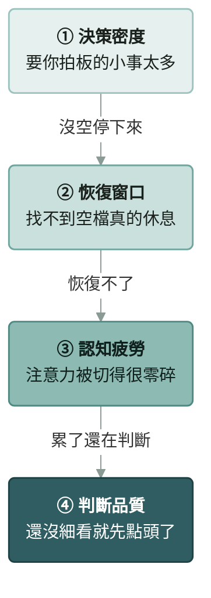

# Decision Pulse

**繁體中文** · [English](README.en.md)

**看看你今天用 AI 工作，腦袋還有沒有餘裕。**

Decision Pulse 是一個 AI agent skill（通用的 `SKILL.md` 格式），Claude Code、Codex、GitHub Copilot、Gemini CLI、Cursor 都能安裝。它讀你電腦上當天的 Claude Code 與 Codex 對話紀錄，產生一頁儀表板，告訴你今天在哪一段最吃力，並附上有認知科學依據的小提醒。

> An agent skill (standard `SKILL.md` format) for Claude Code, Codex, GitHub Copilot, Gemini CLI and Cursor. It reads today's local Claude Code / Codex transcripts and shows, in one page, where your cognitive load piled up — with gentle, research-backed suggestions. Interface is Traditional Chinese only.

---

## 為什麼要做這個

有了 AI 之後，一天要拍板的小事變多了：AI 做完一段就停下來問你、你同時開好幾個對話來回切換、一坐就是好幾個小時。每件事都不難，但加起來，累了自己不一定發現。

Decision Pulse 照這條機制鏈來看你的一天。每一段會把壓力往下一段推：



| 階段 | 看什麼 | 怎麼量 |
|---|---|---|
| ① 決策密度 | 一天要拍板的事有多密 | 每活躍小時你發幾則訊息 |
| ② 恢復窗口 | 中間有沒有真的休息 | 最長一段沒有 10 分鐘以上的休息 |
| ③ 認知疲勞 | 注意力被切得多碎 | 每活躍小時切換幾次對話 |
| ④ 判斷品質 | 還有沒有力氣仔細看 | AI 寫一大段後，幾秒內就回的比例 |

四個階段**各自**分成低／中／高，**不加總成一個分數**。把不同的東西相加只是假精確；分開看，才知道該先處理哪一段。

## 你會看到什麼

- **一句話總結**：今天幾段對話、實際對話多久、最密集的時段、最長一段沒休息多久
- **此刻**（查今天時才有）：這段已經連續多久、距離上次好好休息過了多久
- **四階段分級**：每個階段的數值、落在低中高哪一段、門檻的依據
- **今天想提醒你的幾件事**：只有中、高的階段會出現。像同事在旁邊提醒，不是規則輸出
- **細節**：對話數、你打的字、AI 回的字、token、thinking、早中晚分布、每小時訊息量、休息節奏帶、對話切換、指令長度、審視行為
- **每段活動並排**：把每段工作的條件放在一起看。這張表只呈現條件，不回答「越晚是不是越差」，因為單日樣本太少

## 安裝

需要 Python 3.9 以上，只用標準函式庫，不用裝任何套件。把這個 repo clone 到你用的 AI 工具的 skills 資料夾就好。

| 你用的工具 | 安裝位置 |
|---|---|
| Claude Code | `~/.claude/skills/decision-pulse` |
| Codex、GitHub Copilot、Gemini CLI、Cursor | `~/.agents/skills/decision-pulse`（這幾個工具共用的標準位置） |

**Claude Code**

```bash
git clone https://github.com/chengwesley/decision-pulse ~/.claude/skills/decision-pulse
```

**Codex、GitHub Copilot、Gemini CLI、Cursor**

```bash
git clone https://github.com/chengwesley/decision-pulse ~/.agents/skills/decision-pulse
```

Windows 的 PowerShell 把 `~` 換成 `$HOME`，例如 `"$HOME\.agents\skills\decision-pulse"`。

裝好後重新開啟一次 AI 工具，讓它讀到新的 skill。兩種位置都裝的話，個人設定（`config.local.json`）要各放一份。

各工具的官方說明：[Codex](https://learn.chatgpt.com/docs/build-skills)、[GitHub Copilot](https://code.visualstudio.com/docs/agent-customization/agent-skills)、[Gemini CLI](https://geminicli.com/docs/cli/skills/)、[Cursor](https://cursor.com/docs/skills)。

## 使用

在 AI 工具裡直接用口語問（Claude Code 也可以輸入 `/decision-pulse`），例如：

| 想知道 | 可以這樣問 |
|---|---|
| 整體狀態 | 「看看我今天狀態」、「AI 使用狀況」、「今天用 AI 用得怎樣」 |
| 壓力與疲勞 | 「我今天 AI 壓力」、「我今天是不是太累」、「我該休息了嗎」、「AI 疲勞」 |
| 決策品質 | 「我的 AI 決策品質」、「今天決策品質怎樣」 |
| 專注與節奏 | 「我今天是不是太分散」、「今天切換太多嗎」、「我今天工作節奏」 |
| 使用量 | 「今天用了多少 AI」、「我是不是 AI 用太兇」、「今天認知負荷如何」 |

不用背這些詞，只要是在問「自己今天用 AI 的負荷、疲勞、專注或決策品質」，AI 都會啟用。

第一次使用時，AI 會問你一次職能（見下方），之後就不再問。產生的儀表板是一個 HTML 檔：Claude 會直接顯示成頁面，其他工具會告訴你檔案位置，用瀏覽器打開就好。

也可以不透過 AI，直接跑腳本（路徑換成你的安裝位置）：

```bash
python ~/.agents/skills/decision-pulse/scripts/scan_today.py --html ~/decision-pulse.html
```

| 參數 | 用途 |
|---|---|
| `--date 2026-09-22` | 查指定某一天（預設今天） |
| `--role 工程` | 用別的職能試跑，不改設定檔 |
| `--html <路徑>` | 輸出儀表板頁面 |
| `--json` | 另外印出完整 JSON |
| `--save` | 把這天的頁面與數據存進 `history/`（一個日期一份），之後問到同一天直接用，不用重新掃描 |
| `--record-url <日期> <連結>` | 記下這天的頁面發佈在哪裡 |

## 桌面小時鐘（選用）

不想每次都問的話，可以開 `pulse-clock/pulse-clock.pyw`：一個放在桌面角落的圓形小時鐘，外圈四段弧就是四大指標的等級（綠／黃／橘），中央顯示現在時間和這段已經連續多久。每 30 分鐘自動更新，點一下看數值與提醒，不跳通知。說明見 [`pulse-clock/README.md`](pulse-clock/README.md)。

## 職能

每種工作「正常」的樣子不一樣：工程師可能整天都在跟 AI 一來一往，主管的工作本來就是在不同事情之間切換。所以部分門檻依職能調整。

| 職能 | ① 決策密度門檻（則／活躍小時） | 預設高風險主題 |
|---|---|---|
| 通用 | 25／45 | （空白） |
| 工程 | 40／70 | production、上線、deploy、migration、資料庫、權限、secret |
| 營運・HR | 25／45 | 調薪、薪資、離職、資遣、錄取、申訴、合約、簽署、撤權、個資 |
| 業務 | 20／40 | 報價、折扣、合約、簽約、退款、付款條件 |
| 設計 | 20／40 | 上線、對外發布、品牌 |
| 主管 | 15／30 | 預算、人事、績效、考核、組織調整、合約 |

**職能可以改變「什麼是正常」，不能改變「什麼對大腦是負擔」。** 休息、切換、判斷品質的門檻不隨職能改，放寬這些等於替過勞找理由。密度門檻都是經驗值，歡迎用過後回報你覺得合不合理。

## 個人設定

把 `config.example.json` 複製成 `config.local.json` 再修改。這個檔案不會進版控。

```json
{
  "role": "工程",
  "high_risk_keywords": {"production": 5, "migration": 4}
}
```

可以設定職能、高風險主題關鍵字、不可逆指令清單、時區、早中晚時段邊界、各階段門檻、紀錄路徑。每個欄位的說明都寫在 `config.example.json` 裡。沒有 `config.local.json` 也能產生完整頁面。

## 隱私

- 只讀你自己電腦上的紀錄：`~/.claude/projects` 與 `~/.codex/sessions`
- 腳本不連網、不上傳任何資料
- 產生的頁面會顯示你的專案名稱與命中的高風險主題。要分享給別人看之前，請先自己看過一遍
- 每天的結果存在 skill 資料夾裡的 `history/`，只留在你的電腦，不會進版控
- 頁面開啟時會從 Google Fonts 載入字型

## 研究依據與信心

每一個「研究說」都標出可靠程度。沒有研究依據的門檻，頁面上直接標「經驗值」。

| 用在哪裡 | 依據 | 信心 |
|---|---|---|
| 休息要 10 分鐘以上才有恢復效果 | Albulescu et al. 2022（休息的後設分析） | 中高 |
| 連續高強度工作約 6 小時的前額葉代價 | Blain et al. 2016 | 中（實驗室門檻借用） |
| 切換後注意力會卡在上一件事 | Leroy 2009；Leroy & Glomb 2018 | 中高 |
| 常被打斷，壓力與挫折感上升 | Mark, Gudith & Klocke 2008 | 中高 |
| 同時抓得住的事情大約四件 | Cowan 2001 | 中高 |
| 對自動化的建議照單全收 | Parasuraman & Manzey 2010 | 中 |
| 知道要負責，比較不會盲從機器 | Skitka, Mosier & Burdick 2000 | 中 |
| 事先想好「如果…就…」 | Gollwitzer & Sheeran 2006 | 高 |
| 目標越具體，表現越好 | Locke & Latham 2002 | 中高 |
| 看看遠處、綠色有助恢復專注 | Kaplan 1995 | 中 |
| 刻意想想反面可以減少偏誤 | Lord, Lepper & Preston 1984 | 中高 |

**刻意不用**：「決策疲勞／意志力會用完」（ego depletion，大型複製研究失敗）、90 分鐘超日節律、番茄鐘（非同儕審查）。

## 它不做的事

- **不判斷你的決定對不對。** 對話紀錄裡沒有結果，只能看過程條件
- **不跨日比較。** 只看當天
- **不主動提醒。** 你問了才看
- **不給單一總分**，也不推論情緒
- **建議不是 AI 臨場寫的。** 是規則觸發的固定文字，每天可以對照

設計的完整理由、每個指標的定義與驗收標準在 [`references/spec.md`](references/spec.md)。

## 限制

- Codex 紀錄沒有 AI 回覆字數、token、回覆延遲，這些欄位只算 Claude Code，頁面上會標示
- 介面只支援繁體中文
- 密度與切換門檻是經驗值，還需要更多人用過後校正

## 授權

[MIT](LICENSE)
